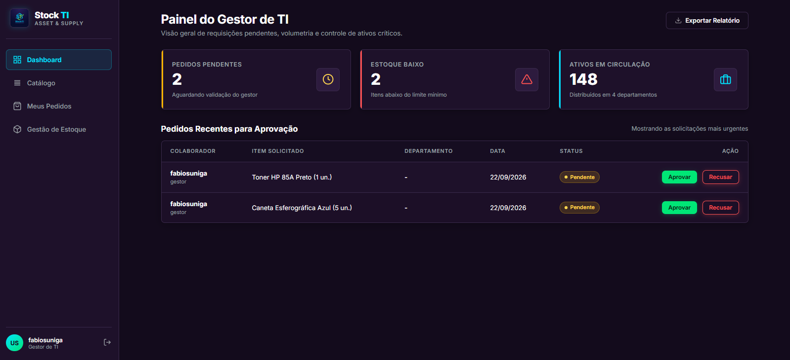
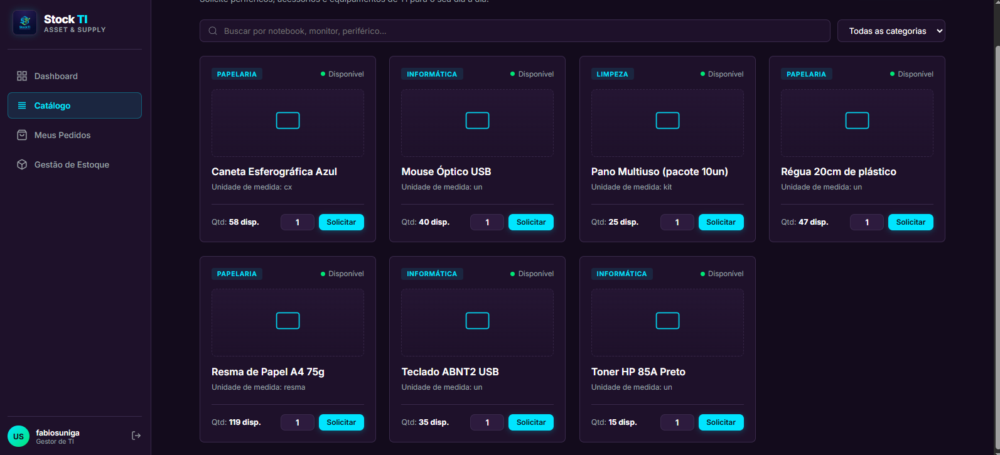
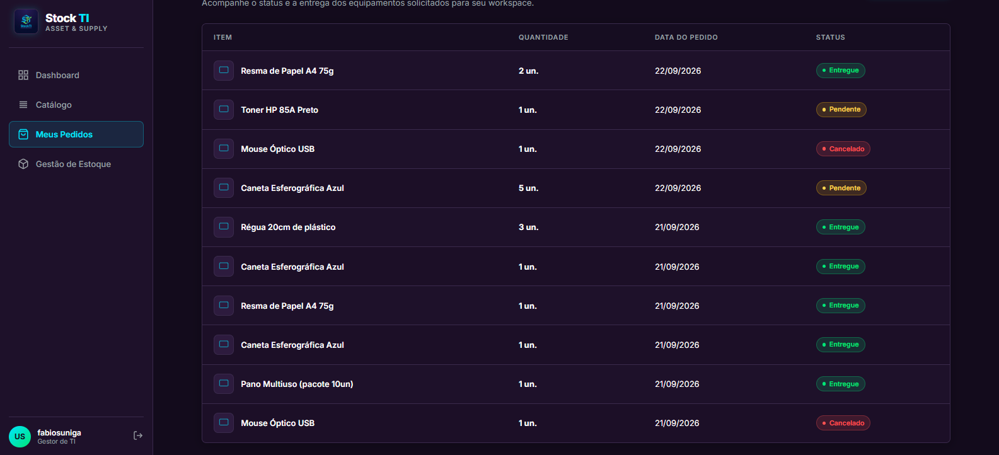
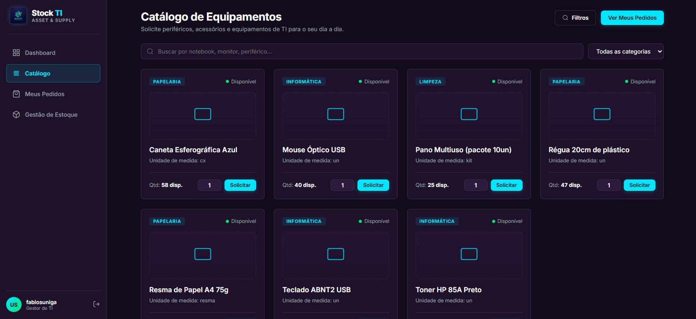

# StockTI - Controle de Insumos e Ativos de TI

Sistema web simples e eficiente para gestão de estoque e solicitações de equipamentos de TI, com controle de acesso (RBAC) e regras de segurança direto no banco de dados.

[](https://fabiosuniga.github.io/sistema-insumos/)

---

## 📸 Telas do Sistema

| Dashboard (Visão do Gestor) | Gestão de Estoque |
|:---:|:---:|
|  |  |

| Meus Pedidos (Acompanhamento) | Catálogo de Produtos |
|:---:|:---:|
|  |  |

---

## ⚙️ Tecnologias Utilizadas

* **Frontend:** HTML5, CSS3, JavaScript Vanilla (Sem frameworks, sem build step)
* **Backend / Banco de Dados:** Supabase (PostgreSQL + API REST automática)
* **Autenticação:** Supabase Auth (E-mail e Senha)
* **Segurança:** RLS (Row Level Security) protegendo os dados no nível do banco
* **Hospedagem:** GitHub Pages

---

## Principais Funcionalidades

**Para Colaboradores:**
- Catálogo com disponibilidade de estoque em tempo real.
- Bloqueio automático contra pedidos duplicados (mesmo item pendente).
- Acompanhamento do status de suas próprias requisições.

**Para Gestores de TI:**
- Dashboard com indicadores (KPIs) de pedidos e alertas de estoque baixo.
- Aprovação ou recusa de solicitações com 1 clique.
- Baixa de estoque automática via **Trigger** no banco de dados ao aprovar pedidos.
- Cadastro rápido de novos itens e inserção manual de estoque.

---

## 🚀 Como testar localmente

1. Clone o repositório:
   ```bash
   git clone https://github.com/fabiosuniga/sistema-insumos.git
